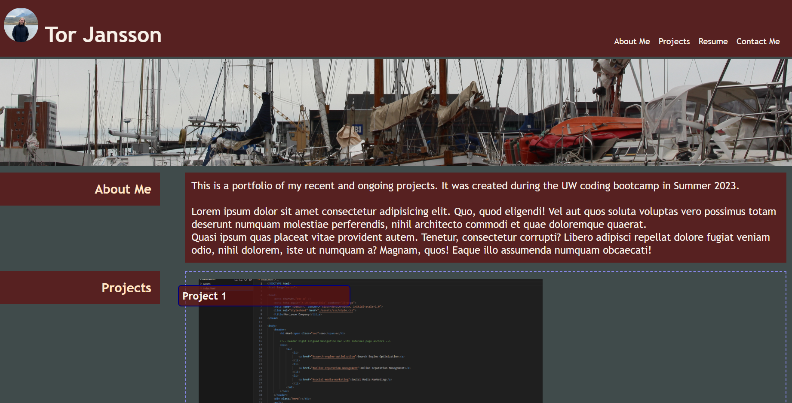

The current project is a portfolio of my project work.

The images should have links and alt text available. 
The navigation has references on the page as well as other html contained in the repo folders. 
The links should navigate to the corresponding sections. 

The first project for this bootcamp is displayed larger and separate from the other items.

The images either redirect to a new page of the project or are written to quickly allow for links. 

The page allows for several different screensizes. 

